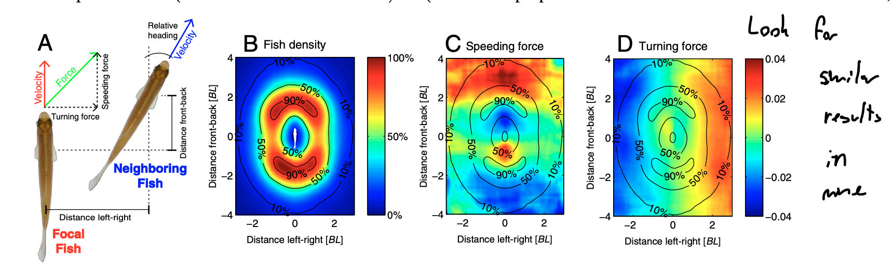
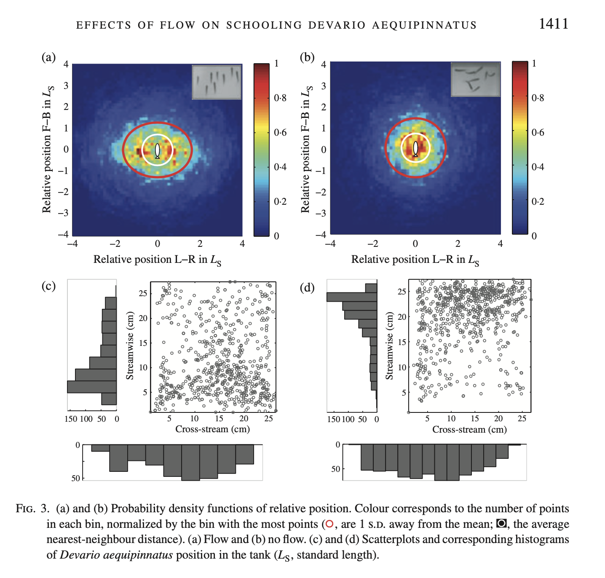
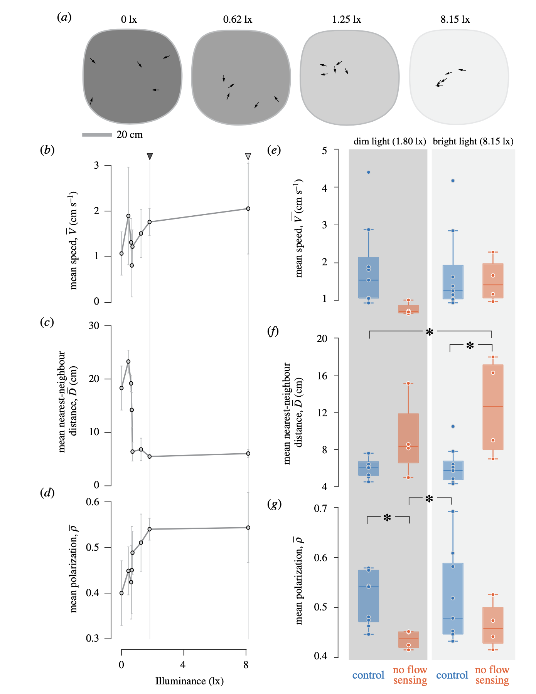

```{r}
library(tidyverse)
library(ggplot2)
library(car)
library(viridis)
library(boot)
```


### Katz, Y., Tunstrom, K., Ioannou, C. C., Huepe, C., & Couzin, I. D. (2011). Inferring the structure and dynamics of interactions in schooling fish. Proceedings of the National Academy of Sciences, 108(46), 18720–18725. https://doi.org/10.1073/pnas.1107583108




```{r}

```


### Chicoli, A., Butail, S., Lun, Y., Bak-Coleman, J., Coombs, S., & Paley, D. A. (2014). The effects of flow on schooling Devario aequipinnatus: School structure, startle response and information transmission. Journal of Fish Biology, 84(5), 1401–1421. https://doi.org/10.1111/jfb.12365



```{r}

```

### McKee, A., Soto, A. P., Chen, P., & McHenry, M. J. (2020). The sensory basis of schooling by intermittent swimming in the rummy-nose tetra ( Hemigrammus rhodostomus ). Proceedings of the Royal Society B: Biological Sciences, 287(1937), 20200568. https://doi.org/10.1098/rspb.2020.0568




```{r}

```

